# Edges

Edges are the lines and arrows that connect objects in Draw.io. There's quite a bit of variabiability in how they're created and styled so there's a bit more complexity than with objects.

## Creating a basic edge

Like objects, there's a Edge object that can be easily created:

```python
link = drawpyo.diagram.Edge(
    page=page,
    source=item_1,
    target=item_2,
    )
```

## Edge Labels

The value of an edge is the label that appears on it. It can be set using the `label` value.

The position of the label can be fine tuned with two parameters:

| Parameter        | Effect                                                                                                                                                                     |
| ---------------- | -------------------------------------------------------------------------------------------------------------------------------------------------------------------------- |
| `label_position` | The position along the edge's axis where the label appears. This is float value between -1 and 1. 0 is neutral/in the center, -1 is at the source, and 1 is at the target. |
| `label_offset`   | The offset in pixels perpendicular to the axis of the edge.                                                                                                                |

#### Label Positions Rendered

    

## Edge Geometry

Besides the source and target, the edge geometry can be very finely tuned. There are eight parameters that control where and how the edge meets the source and target objects:

| Parameter                | Definition                                                                        |
| ------------------------ | --------------------------------------------------------------------------------- |
| `entryX`                 | From where along the X axis on the source object the edge originates (0-1)        |
| `entryY`                 | From where along the Y axis on the source object the edge originates (0-1)        |
| `entryDx`                | Applies an offset in pixels to the X axis entry point                             |
| `entryDy`                | Applies an offset in pixels to the Y axis entry point                             |
| `exitX`                  | From where along the X axis on the target object the edge originates (0-1)        |
| `exitY`                  | From where along the Y axis on the target object the edge originates (0-1)        |
| `exitDx`                 | Applies an offset in pixels to the X axis exit point                              |
| `exitDy`                 | Applies an offset in pixels to the Y axis exit point                              |
| `targetPerimeterSpacing` | The negative or positive spacing between the target and end of the edge in points |
| `sourcePerimeterSpacing` | The negative or positive spacing between the source and end of the edge in points |

If these parameters are set to `None` then the Draw.io rendering engine will place the origination and direction of the edge wherever makes the most sense based on the layout of the objects. This is the same as the behavior in the app when an edge is dragged to the center of a shape (highlighting the whole object green) instead of to a specific node on the border (and seeing just that node highlighted in green).

They can also be set to X and Y coordinates designating where on the source and target objects the edge will meet it. The rest of the routing will be handled automatically.


Some examples of different coordinate settings:

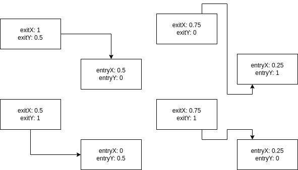

Other attributes for controlling the general shape of the object are:

| Parameter   | Definition                                                                                                   |
| ----------- | ------------------------------------------------------------------------------------------------------------ |
| `jettySize` | Defines the length of the straight line coming out of or into an object before the edge makes its first turn |

## Points

You can also add points to Edges to further fine tune their routing. This isn't always necessary, usually setting the entry/exit parameters handles the auto routing correctly. However this is an option, using the `Edge.add_point()` and `Edge.add_point_pos()` functions. The edge will then route through those points but auto layout otherwise.

## Styling edges

Just about every edge styling option from the Draw.io app is implemented in Drawpyo. It's easiest to just play with all of the different line styling options in Draw.io to understand how they render but the major options are listed here.

### Text Styling

The styling within an an edge label is contained inside of a `TextFormat` object. All styling parameters can be accessed at the attribute `Edge.text_format`, which contains a `TextFormat` object.

For more information about styling text, see [Formatting Text](/drawpyo/usage/text_format) for more information.

### Color and Shading

Edge coloring can be set with a stroke and fill color, though only the stroke applies to a simple edge.

| Parameter     | Effect                                                                                             |
| ------------- | -------------------------------------------------------------------------------------------------- |
| `opacity`     | The opacity of the edge (0-100)                                                                    |
| `strokeColor` | The color of the edge or the stroke around the edge shape ('default', 'none', or a hex color code) |
| `fillColor`   | The fill color of the edge shape ('default', 'none', or a hex color code)                          |

### Effects

Draw.io has four effects that can be set on an edge. They're all boolean valuable that can be enabled.

| Paramater        | Rendered                                                                    |
| ---------------- | --------------------------------------------------------------------------- |
| default (None)   |                |
| `rounded`        | 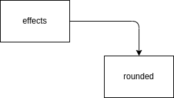               |
| `shadow`         |                  |
| `sketch`         | 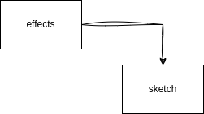                 |
| `flowAnimation`* |  |

> *(this animates in Draw.io)

### Jumps

By default, when an edge crosses another edge they'll just be rendered as a cross. You can also enable line jumps; the top edge will 'jump' over the bottom edge. There are different styles of line jumps and they can have variable sizes as well.

| Parameter   | Effect                                                               |
| ----------- | -------------------------------------------------------------------- |
| `jumpStyle` | The style of the line jump. Can be 'arc', 'gap', 'sharp', or 'line'. |
| `jumpSize`  | The size of the rendered line jumps in points.                       |

The different rendered jump styles are:

| Parameter      | Rendered                                                          |
| -------------- | ----------------------------------------------------------------- |
| default (None) |  |
| `arc`          |          |
| `gap`          |          |
| `sharp`        |      |
| `line`         |        |

### Waypoints

The `waypoint` parameter controls how the line is routed from the source to the target. For example, a straight line is just point to point. A curved line tries to maintain gentle curves and perpendicularity to the source and target objects. Options are:

| Parameter            | Rendered                                                                                |
| -------------------- | --------------------------------------------------------------------------------------- |
| default (None)       | 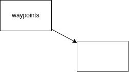                       |
| `straight`           | 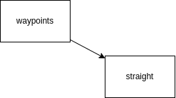                     |
| `orthogonal`         | 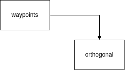                 |
| `vertical`           | 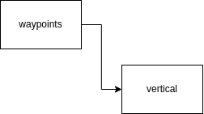                     |
| `horizontal`         | 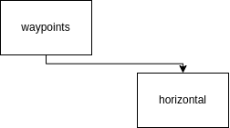                 |
| `isometric`          | 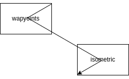                   |
| `isometric_vertical` | 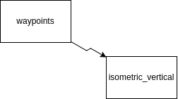 |
| `curved`             | 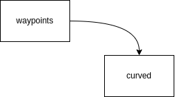                         |
| `entity_relation`    | 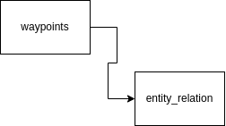       |

### Connections

The `connection` parameter is abstractly named but it controls what type of edge this is. Most edges are lines but other types are available.

| Parameter      | Rendered                                                                        |
| -------------- | ------------------------------------------------------------------------------- |
| default (None) | 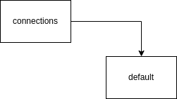           |
| `line`         | 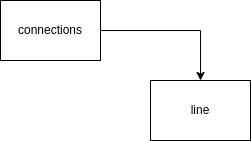                 |
| `link`         |                  |
| `arrow`        |                |
| `simple_arrow` | 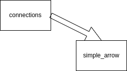 |

### Patterns

The `pattern` parameter controls how the line stroke is rendered. Options are:

| Parameter       | Rendered                                                                    |
| --------------- | --------------------------------------------------------------------------- |
| default (None)  | 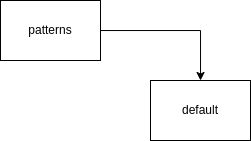             |
| `solid`         | 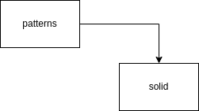                 |
| `dashed_small`  |    |
| `dashed_medium` |  |
| `dashed_large`  |    |
| `dotted_small`  |    |
| `dotted_medium` | 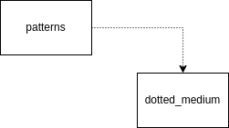 |
| `dotted_large`  |    |

### Line Ends

The `line_end_target` and `line_end_source` parameter sets whatever is rendered where the edge meets the objects. There are secondary boolean parameters for the fill of the ends (`endFill_target` and `endFill_source`) but not all ends can be filled.

The line end size can also be adjusted with `endSize` and `startSize` parameters, both set in points.

| Parameter      | Rendered Unfilled                                                         | Rendered Filled                                                                       |
| -------------- | ------------------------------------------------------------------------- | ------------------------------------------------------------------------------------- |
| default (None) |            | *na*                                                                                  |
| `classic`      |            | 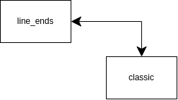         |
| `classicThin`  | 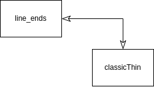   |  |
| `open`         |                  | *na*                                                                                  |
| `openThin`     |          | *na*                                                                                  |
| `openAsync`    |        | *na*                                                                                  |
| `block`        |                |              |
| `blockThin`    |        |      |
| `async`        |                |              |
| `oval`         | 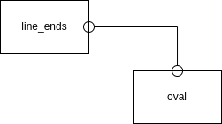                 | 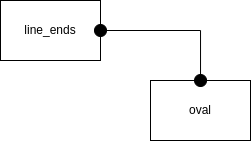               |
| `diamond`      | 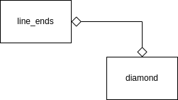           |          |
| `diamondThin`  |    |  |
| `dash`         |                  | *na*                                                                                  |
| `halfCircle`   | 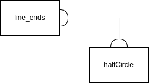     | *na*                                                                                  |
| `cross`        | 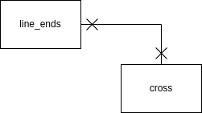               | *na*                                                                                  |
| `circlePlus`   | 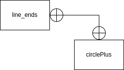     | *na*                                                                                  |
| `circle`       | 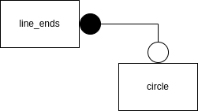             | *na*                                                                                  |
| `baseDash`     |          | *na*                                                                                  |
| `ERone`        |                | *na*                                                                                  |
| `ERmandOne`    | 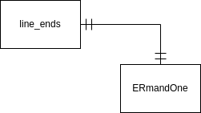       | *na*                                                                                  |
| `ERmany`       |              | *na*                                                                                  |
| `ERoneToMany`  |    | *na*                                                                                  |
| `ERzeroToOne`  |    | *na*                                                                                  |
| `ERzeroToMany` |  | *na*                                                                                  |
| `doubleBlock`  |    | 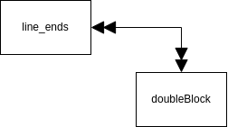 |
