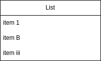

# Extended Objects
While any of the objects in Draw.io can be created by setting the correct combination of attributes it's not always convenient, particularly when an 'object' is actually a small group of objects. To offer a little more convenience drawpyo has extended objects. These inherit from the Object class but extend it with added functionality, though not quite to the level of the custom diagram types.

There's only one extended object implemented now but there could be more in the future, either mirroring Draw.io functionality or new object types.

## List

A list object is available in the General library in Draw.io. It's simple a small container object with a horizontal label filled with text objects as the list items. The Draw.io app conveniently keeps the list items positioned and in order as you add or remove, also scaling the size of the list container.



### Creating a List

To create a list in drawpyo, use the `diagram.List` object.

```python
new_list = drawpyo.diagram.List(title="List", page=page, width=200)
```

Like any other Object, the position and geometry can be set during creation as well as various styling attributes.

### Adding Items

There are a few methods of adding items. The easiest would be using the `.add_item()` method.

```python
new_list.add_item("item 1")
new_list.add_item("item B")
new_list.add_item("item iii")
```

This will create a text object, set the List as its parent, position it correctly, and then resize the List object.

You can also access the property `list_items`. It will return a list of strings denoting all the items in the list. But it also has a setter property, so setting it to a list of strings will remove existing items and then go through the creation and resizing process.

### Deleting Items

The easiest way to delete an item is to call the `.remove_item()` method. Pass in the text of the item to remove and it will be strucken from the list then the list resized.

```python
new_list.remove_item("item B")
```

### Resizing the List

The list will be automatically resized to match the contents when the above methods are called. But the resize can also be called manually with the `.autosize()` method.
