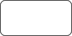

# Objects

Though some diagram types have their own object subclasses, the main class for creating objects is the Object class.

## Creating a basic object

```python
base_obj = drawpyo.diagram.Object(page=page)
```

The default object type is a rounded corner rectangle with white background and a black border just like in the Draw.io app.



The value attribute holds the text to display in the object.

```python
base_obj.value = "This Object's Name is Fred"
```


### Creating an object from a shape library

Just like the built-in shape libraries in the Draw.io app, Drawpyo supports generating shapes from libraries. Currently the 'general' and 'flowchart' libraries from the Draw.io app is defined but more will be added in the future.

> These libraries are defined in TOML files and drawpyo supports importing custom shape libraries! See [Shape Libraries](/drawpyo/usage/shape_libs) for more information.

To generate an object from a library:

```python
object = drawpyo.diagram.object_from_library(
    library="general",
    obj_name="process",
    page=page,
    )
```

This function returns a normal Object but prestyled by the library. It can then be further styled or modified.

## Object Geometry

All objects contain a structure called ObjectGeometry that provides a layer of abstraction. Interacting directly with the geometry class is optional.

### Object Sizing

The three parameters that affect object placement are size and aspect. Size has to be set individually with the .width and .height attributes.

```python
Object.width = 120
Object.height = 80
Object.aspect = 'fixed'
```

> In earlier versions there was a 'size' attribute. But then it was found that 'size' was also used as a style attribute for certain shapes so the geometry size attribute was removed in favor of using width and height directly.

### Object Geometry and Placement

Repositioning objects is simple but there are a few convenience features to know about. There are two attributes available for setting the position by either the top left corner or the center:

```python
Object.position = (0, 0)
Object.center_position = (0, 0)
```

The X and Y positions can also be accessed directly in the geometry object.

```python
Object.geometry.x = 0
Object.geometry.y = 0
```

## Styling Objects

### Generating from a style string

While styling an object from scratch in drawpyo is possible, you're probably using drawpyo because Draw.io exists and is a great UI so use it! The easiest workflow is to style objects in Draw.io, or at least play with the different parameters to understand how they'll render visually.

Once you have an object styled in Draw.io how you like it, you can replicate the styling attributes you want manually or just copy the style string.

To do this, first style an object as much as you want:


Then right click on the object and select 'Edit Style:'. The following pop-up will show the exact style string:


This style string can be copied into the drawpyo function `apply_style_string`:

```python
style_str_obj = drawpyo.diagram.Object(page=page)

style_str_obj.apply_style_string(
    "rounded=1;whiteSpace=wrap;html=1;fillColor=#dae8fc;strokeColor=#6c8ebf;gradientColor=#63B6FF;glass=1;strokeWidth=5;shadow=1;"
)
```

The `style_str_obj` will now have all of the custom styled attributes. It can also be used as a template object for others.

### Styling Manually

There are infinite permutations of object formatting and styling available. There are some higher order attributes that set the template for the object. What lower order styling attributes may or may not apply in combination. Then there are attributes like size and text formatting that apply in all cases. These interactions are difficult to predict in drawpyo alone so a good way to get familiar with all of the possible options and types of customizations is just to play with the Draw.io app directly to design formatting to your taste.

Almost all styling attributes are optional (and drawpyo adds the non-optional ones automatically). If an attribute is unset or set to None then it won't be included in the file output. This will set that specific styling behavior to a default mode.

#### Text Styling

The styling within an object is contained inside of a `TextFormat` object. All styling parameters can be accessed at the attribute `Object.text_format`, which contains a `TextFormat` object.

For more information about styling text, see [Formatting Text](/drawpyo/usage/text_format) for more information.

#### BaseStyle and Shape

The highest order styling attribute in Draw.io for objects is `shape`. This sets how the object behaves and is rendered. Different values include:

- parallelogram
- shape
- process
- hexagon
- document
- cylinder3
- internalStorage
- cube
- step
- tape
- trapezoid
- note
- card
- callout
- dataStorage

and many more.

Confusingly there is another attribute called `baseStyle` that is sometimes used in combination with `shape` and sometimes without.

BaseStyles include:

- text
- ellipse
- rhombus
- triangle
- swimlane

It can be hard to predict how these two attributes will interact. To utilize them it's recommended to start in the Draw.io app, use their shape libraries or templates to get the desired style, then look at the style string to see what `shape` and `baseStyle` were used. When creating an object from a shape library these two attributes are handled automatically.

#### Basic Styling Attributes

These attributes mostly apply to most shape/baseStyle combinations and can be set on almost any object.

- rounded
- fillColor
- strokeColor
- opacity
- whiteSpace
- glass
- shadow
- comic
- line_pattern

#### Further Styling Attributes

As mentioned above, not all of these attributes will apply to all object shapes and types. But some commonly called include:

- darkOpacity
- darkOpacity2
- backgroundOutline
- perimeter
